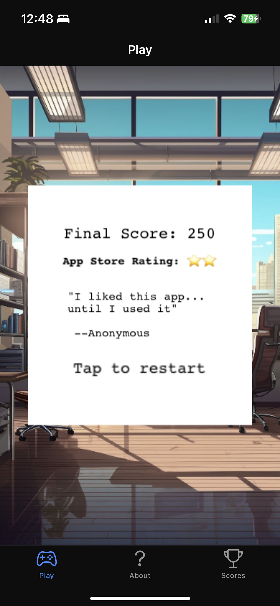
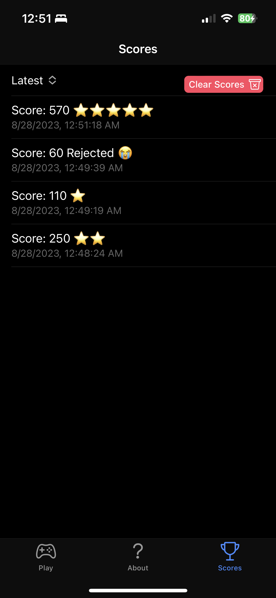

# Ionitron: The Game

> ⚠️ **Note**: Not yet tested on Android, let me know if there are any issues!


* [Gameplay](#gameplay)
* [About](#about)
  + [Overview](#overview)
  + [Tech Stack Concepts Demonstrated](#tech-stack-concepts-demonstrated)
    - [Phaser](#phaser)
    - [Ionic](#ionic)
    - [Capacitor](#capacitor)
    - [Vue](#vue)
  + [App Features](#app-features)
    - [Responsive Layout](#responsive-layout)
    - [Selective Scene Inclusion](#selective-scene-inclusion)
    - [Local Storage of Game Scores](#local-storage-of-game-scores)
    - [Data transfer between Phaser & Vue](#data-transfer-between-phaser--vue)
    - [Sorting Scores](#sorting-scores)
* [Running the Game](#running-the-game)
  + [In a Browser](#in-a-browser)
  + [On a Mobile Device](#on-a-mobile-device)


## Gameplay

   

In this game, you are Ionitron, a hard-working cross-platform developer! You use your web skills to build mobile apps for iOS and Android using Ionic and Capacitor.

The success of your apps depend on creating a great user experience. Your score increases when your users are happy, but unhappy users can tank your rating. Whatever you do, avoid the bugs!

New test devices and a hot pot of coffee will prevent bugs and bad reviews, but they don't last forever.

Good luck!


## About

### Overview

Built with Phaser, Ionic, Capacitor, and Vue, using Vite.

https://phaser.io/
https://ionicframework.com/
https://capacitorjs.com
https://v3.vuejs.org

This is an Ionic Vue app that launches a Phaser game instance within the `PhaserContainer` component.

This app was created specifically to demonstrate how to build with Phaser and Ionic Vue using Vite and TypeScript. I couldn't find any examples of this specific tech stack combination so hopefully it's helpful for others that want to build mobile games with web technologies!

Thanks to the following resources that helped me along the way:
- https://www.youtube.com/@OpenForge/videos
- https://github.com/Sun0fABeach/vue-phaser3
- https://github.com/openforge/ionic-phaser-game-template
- https://www.codecademy.com/courses/learn-phaser
- https://phaser.io/tutorials/making-your-first-phaser-3-game/part1
- ChatGPT & GitHub Copilot 🙏

### Tech Stack Concepts Demonstrated

#### Phaser
- Game instance launch
- Changing between scenes
- Pausing a scene
- Selective scene inclusion
- Adding images, text, and sprites
- Scaling game objects and physics values based on screen size
- Adding physics objects and groups
- Dynamic game object generation
- Sprite animation
- Game object movement
- Collision detection
- Keyboard controls
- On-screen controls
- Emitting data via events

#### Ionic
- Ionic component and icon usage
- Ionic routing
- Ionic CSS Utility classes
- Ionic built-in dark/light themes

#### Capacitor
- Building to iOS and Android
- Checking if platform is native
- Saving to local device storage

#### Vue
- Vue 3, Composition API
- `<script setup` tag
- Reactivity with `ref` and `reactive`
- `computed` values
- `provide` and `inject`
- `v-for`, `v-if`, and `v-model` attributes
- Component mounting lifecycle methods
- scoped styling

### App Features

#### Responsive Layout

App and game are responsive for all screen sizes, but mobile view is recommended for optimal game play due to player movement speed.

- Uses Ionic components for tabbed layout, buttons, lists, icons, and selects
- Ionic Vue app is responsive using Flexbox
- Phaser game is responsive using the `Phaser.Scale.RESIZE` mode. This means that the game will resize to fit the parent container, potentially altering the aspect ratio.
  - Because I am using `RESIZE`, my Phaser game dynamically scales game objects based on the screen size. This may not be the best option for some games.
  - An alternative is to use `Phaser.Scale.FIT`, which will always ensure the game has the same aspect ratio and fits inside the parent container. This may result in black bars around the game to fill out the screen.
- The scale configuration takes into account the `devicePixelRatio` to ensure quality rendering on high-DPI (Retina) displays.

#### Selective Scene Inclusion

The player can toggle a "Show Rules?" checkbox to determine if the initial Phaser `StartScene` is shown.

```js
// src/components/PhaserContainer.vue
// in template
<ion-checkbox v-if="showLaunch" labelPlacement="end" v-model="showRules">Show Rules?</ion-checkbox>
```

The checkbox uses `v-model` to bind to the `showRules` ref, which determines which scenes are passed to the Phaser `launch()` function. It is true by default.

```js
let gameInstance: Game;
const showRules = ref(true);

const includedScenes = showRules.value ? ['StartScene', 'PlayScene', 'PauseScene', 'ScoreScene'] : ['PlayScene', 'PauseScene', 'ScoreScene']

gameInstance = launch(includedScenes);
```

#### Local Storage of Game Scores

User game score history is stored to local storage on device (Capacitor Preferences API) or browser (Local Storage API). This ensures saves scores are persistent across browser refresh or app closure.

- Uses [Capacitor's `isNativePlatform()` method](https://capacitorjs.com/docs/core-apis/web#isnativeplatform) to determine which storage method to use.
- **Note:** [Capacitor Preferences API](https://capacitorjs.com/docs/apis/preferences) is only meant for light storage of key/value pairs. Because of this, we are only storing 10 scores at a time, and removing the 'rating' property because this can be calculated. To save more data, use an [actual storage solution or database](https://capacitorjs.com/docs/guides/storage).
- Clear list of scores from storage with button click on Scores page

Score storage is handled with four functions, `loadGameScores()`, `addGameScore()`, `saveGameScores()`, and `clearGameScores()`. These are all defined in the `App.vue` component.

The `loadGameScores()` function is called on component initialization and loads scores from local storage.

The `addGameScore()` function adds the newest score to a `gameScores` Vue reactive and calls `saveGameScores()`, which stores the updated stringifed scores array locally.

The `clearGameScores()` function is provided to the `ScoresPage.vue` component to handle the click of the "Clear Scores" button. It clears the `gameScores` array and also calls `saveGameScores()`.

```js
// src/App.vue

const gameScores = reactive<GameScore[]>([]);

const loadGameScores = async () => {
    let scoresString = '';

    if (Capacitor.isNativePlatform()) {
        const result = await Preferences.get({ key: 'gameScores' });
        scoresString = result.value || '';
    } else {
        scoresString = localStorage.getItem('gameScores') || '';
    }

    // logic that adds back in rating property here

        gameScores.splice(0, gameScores.length, ...parsedScores);
};

const saveGameScores = async (minimizedGameScores: Omit<GameScore, 'rating'>[]) => {
  const scoresString = JSON.stringify(minimizedGameScores);

  if (Capacitor.isNativePlatform()) {
    await Preferences.set({
        key: 'gameScores',
        value: scoresString
    });
  } else {
    localStorage.setItem('gameScores', scoresString);
  }
}

const addGameScore = (score: number, rating: string) => {
    if (gameScores.length >= 10) {
        gameScores.shift();
    }
    gameScores.push({score, rating, date: new Date().toLocaleString()});

    const minimizedGameScores = gameScores.map(({score, date}) => ({score, date}));

    saveGameScores(minimizedGameScores);
}

  loadGameScores();

const clearGameScores = async () => {

    gameScores.splice(0, gameScores.length);

    saveGameScores([]);
}

provide<GameScoresProvider>('gameScores', {
  gameScores,
  addGameScore,
  clearGameScores
});
</script>
```

#### Data Transfer Between Phaser & Vue

Scores are emitted from the Phaser game instance to the parent Vue app using a custom event that includes the game score and a calculated "App Store Rating" based on the score.

```js
// src/game/game.js

 const gameEndEvent = new CustomEvent("gameEnded", {
        detail: { score: gameState.score, rating: appStoreRating }
      });
    
      window.dispatchEvent(gameEndEvent);
```

The `PhaserContainer` Vue component adds and removes the listener for this custom event, as well as calls the handler function. The handler function calls the injected `addGameScore()` function.

```js
// src/components/PhaserContainer.vue

<script setup lang="ts">

const { gameScores, addGameScore } = inject<GameScoresProvider>('gameScores')!;

function handleGameEnded(event: Event) {
  const customEvent = event as CustomEvent;
  addGameScore(customEvent.detail.score, customEvent.detail.rating);
}

onMounted(() => {
  window.addEventListener("gameEnded", handleGameEnded);
});

onUnmounted(() => {
  window.removeEventListener("gameEnded", handleGameEnded);
});
</script>
```

#### Sorting Scores

The list of scores is sorted using a Vue `computed()` method that sorts the injected `gameScores` reactive based on the sort method stored in the `sort` ref.

```js
// src/views/ScoresPage.vue

const { gameScores, clearGameScores } = inject<GameScoresProvider>('gameScores')!;
const sort = ref("latest");

const sortedScores = computed(() => {
  return gameScores.sort((a, b) => {
    switch (sort.value) {
      case "highest":
        return b.score - a.score;
      case "lowest":
        return a.score - b.score;
      case "latest":
        return (
          new Date(b.date).getTime() - new Date(a.date).getTime()
        );
      default:
        return 0;
    }
  });
});
```

The `sort` ref is bound to an `<ion-select>` component using `v-model`. Because `sort` is a dependency of the `sortedScores` computed value, the `sortedScores` will automatically re-compute whenever the `sort` value changes.

```js
 <ion-select aria-label="sort" interface="popover" v-model="sort">
    <ion-select-option value="highest">Highest Score</ion-select-option>
    <ion-select-option value="lowest">Lowest Score</ion-select-option>
    <ion-select-option value="latest">Latest</ion-select-option>
</ion-select>
```

The `sortedScores` are then passed to a `v-for` attribute in a `<ion-item>` component to display each score in an `<ion-list>`.

```js
<ion-list>
  <ion-item v-for="(score, index) in sortedScores" :key="index">
    <ion-label>
      <h2>Score: {{ score.score }} {{ score.rating }}</h2>
      <p>{{ score.date }}</p>
    </ion-label>
  </ion-item>
</ion-list>
```
## Running the Game

### In a Browser

- Fork and clone the repo
- Run `npm install`
- Run `ionic serve` if you have the Ionic CLI installed, otherwise run `npm run dev` to start a Vite server and launch the game in a browser
- Use your browser DevTools to view in a mobile viewport
- Use keyboard arrow keys (recommended) or on-screen controls to play

## On a Mobile Device

To run this game on a mobile device, you will need to have an environment setup for building to iOS and/or Android with Capacitor.

Check out the [Capacitor Environment Setup docs here](https://capacitorjs.com/docs/getting-started/environment-setup).

Once your environment is set up:

- Fork and clone the repo.
- Run `npm install`

The following steps can be done via the terminal or with the Ionic VS Code Extension (recommended).

- Create a production web build with `npm run build`
- Sync the web build to the native projects with `npx cap sync`
- Open the project in Xcode or Android Studio

Once you are in Xcode or Android Studio:

- Connect your mobile device (must be configured for development)
- Select your mobile device as the target and run the app
- The app will be installed on your device and you can play!

You can also run on an emulator/simulator device, although the on-screen controls will be difficult to use without touch functionality.
